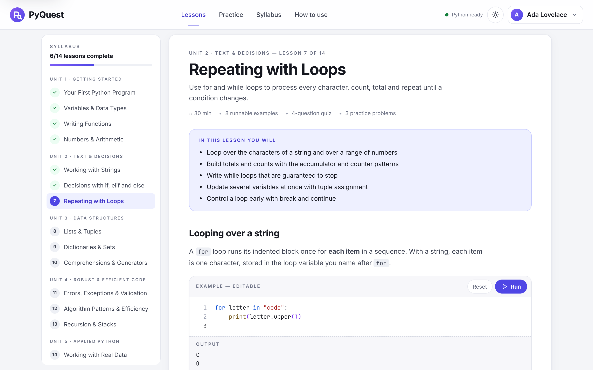
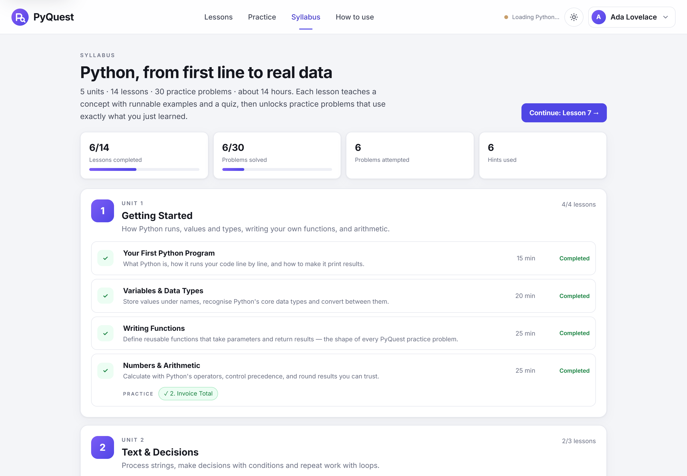
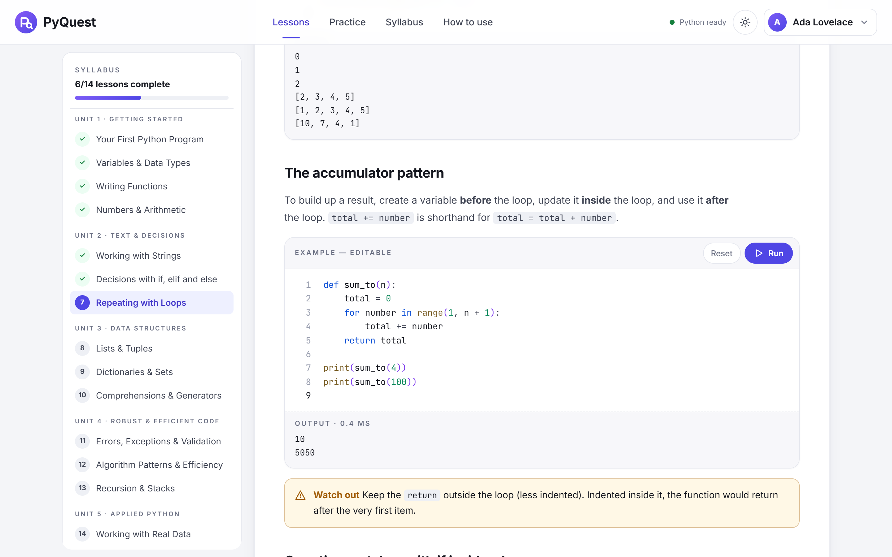
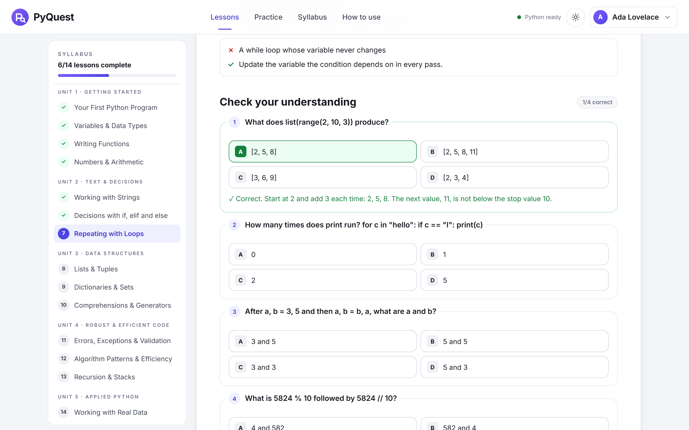
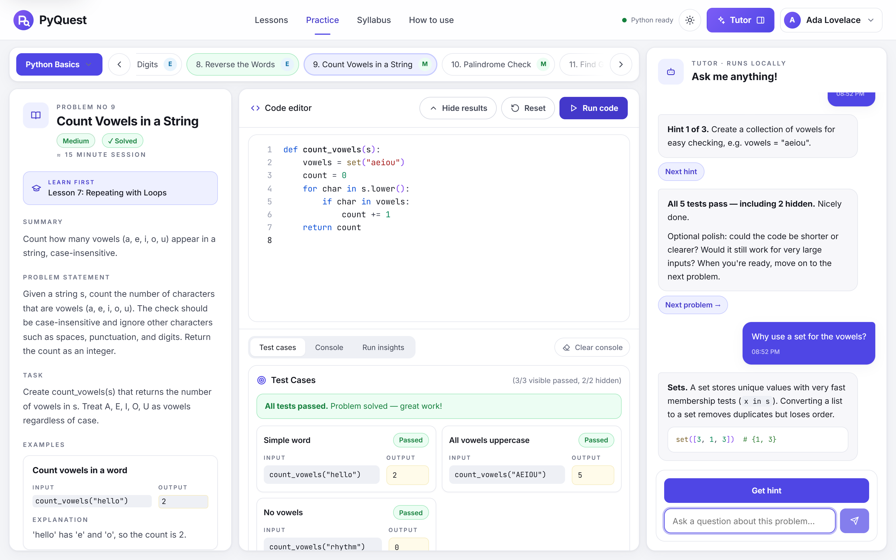
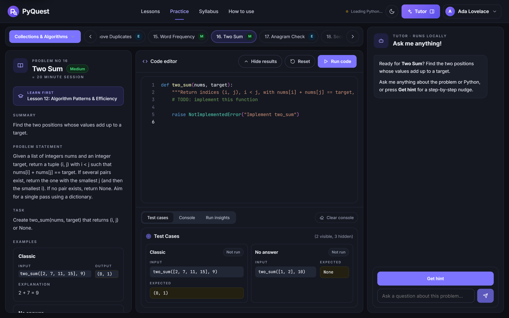
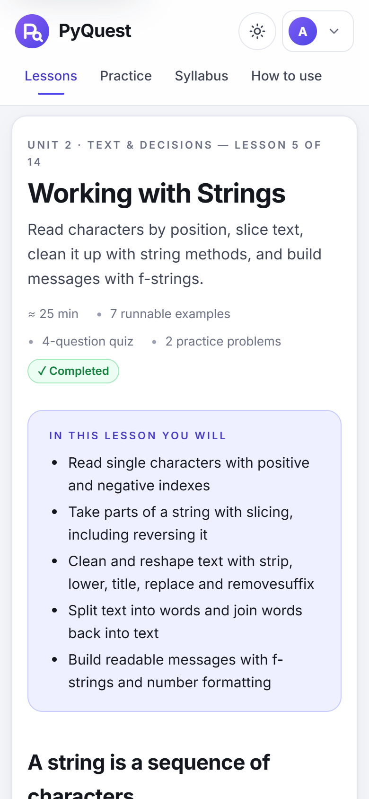
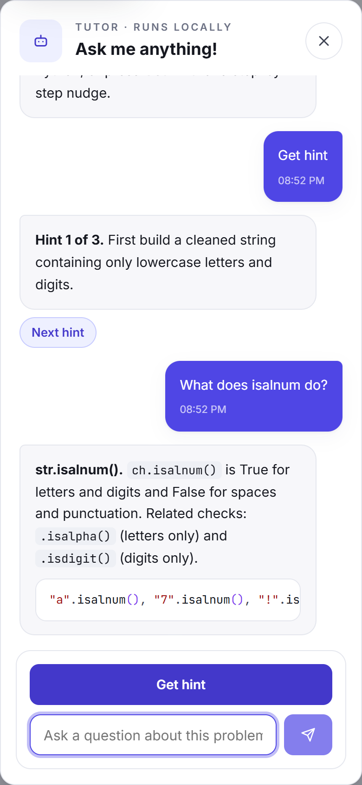
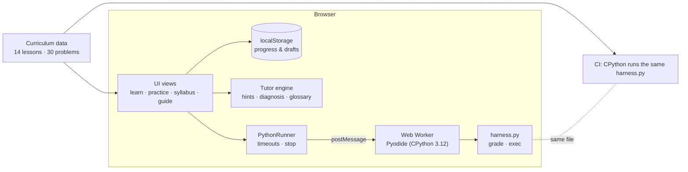

<div align="center">


# PyQuest

**A complete, browser-based Python course: guided lessons, real Python, instant feedback.**

[](https://github.com/ali-kin4/py-quest-interactive-tutor/actions/workflows/ci.yml)
[](https://ali-kin4.github.io/py-quest-interactive-tutor/)
[](LICENSE)


[**Open PyQuest →**](https://ali-kin4.github.io/py-quest-interactive-tutor/)

</div>

PyQuest teaches Python from your first `print()` to processing real data. **14 lessons** across **5 units** explain each concept with editable, runnable examples and end with a quiz. Each lesson then unlocks **practice problems** that use exactly what it taught: **30 in total**, graded by real Python 3 in your browser. A built-in tutor gives hints and explains failing tests. There is no account and no install, and nothing you write leaves your browser.



## Contents

- [The learning loop](#the-learning-loop)
- [Syllabus](#syllabus)
- [Screenshots](#screenshots)
- [Features](#features)
- [Getting started](#getting-started)
- [Quality gates](#quality-gates)
- [Architecture](#architecture)
- [Accessibility, privacy and security](#accessibility-privacy-and-security)
- [Contributing](#contributing)
- [License](#license)

## The learning loop

1. **Learn.** Each lesson covers one topic in short sections, with worked examples you can edit and run, *Tip / Note / Watch out* callouts, key takeaways and common mistakes.
2. **Check.** A quiz with explanations for every answer. Getting every question right completes the lesson.
3. **Practise.** The lesson links to its practice problems. Each one has a full brief, worked examples, visible and hidden tests, and a "Learn first" link back to the lesson.
4. **Get unstuck.** The tutor gives three progressively more specific hints, then a fill-in-the-blanks scaffold, and only then (if you ask) the reference solution. Ask "why is my code failing?" after a run to get a diagnosis.

## Syllabus

About 14 hours of material: 360 minutes of lessons and 461 minutes of practice.

| Unit | Lesson | Time | Practice problems |
| --- | --- | --- | --- |
| 1. Getting Started | 1. Your First Python Program | 15 min | — |
| | 2. Variables & Data Types | 20 min | — |
| | 3. Writing Functions | 25 min | — |
| | 4. Numbers & Arithmetic | 25 min | Invoice Total |
| 2. Text & Decisions | 5. Working with Strings | 25 min | Greet a Customer, Reverse the Words |
| | 6. Decisions with if, elif and else | 25 min | Even or Odd, Letter Grade, Discount Tiers, Leap Year, Support Ticket Triage |
| | 7. Repeating with Loops | 30 min | Sum of Digits, Count Vowels in a String, Find Greatest Common Divisor |
| 3. Data Structures | 8. Lists & Tuples | 25 min | FizzBuzz, Calculate List Statistics, Chunk a List |
| | 9. Dictionaries & Sets | 25 min | Remove Duplicates, Word Frequency, Anagram Check, Second Largest Value |
| | 10. Comprehensions & Generators | 25 min | Palindrome Check, Clean Transaction Amounts, Flag Invalid Sensor Readings |
| 4. Robust & Efficient Code | 11. Errors, Exceptions & Validation | 25 min | Validate a Percentage, Average Customer Rating |
| | 12. Algorithm Patterns & Efficiency | 30 min | Two Sum, Merge Two Sorted Lists, Moving Average |
| | 13. Recursion & Stacks | 30 min | Flatten Nested Lists, Balanced Brackets |
| 5. Applied Python | 14. Working with Real Data | 35 min | Summarise Log Levels, Capstone: Revenue Summary |

Lessons 1–3 lay the foundations (how Python runs, types, and writing functions that `return`), so every practice problem afterwards is a function you write and the tests call.

## Screenshots

**Syllabus.** Every unit, lesson and linked practice problem, with progress.



**Runnable examples and quizzes.** Every example is editable; the quiz explains each answer.

| Editable example | Lesson quiz |
| --- | --- |
|  |  |

**Practice workspace.** Problem brief, editor with test results, and the tutor.



**Dark theme.** Follows your system setting, with a manual toggle.



**On a phone.** A responsive layout; the tutor becomes a slide-over drawer.

<p>
  
  &nbsp;
  
</p>

## Features

**Teaching**
- 14 lessons with objectives, 98 runnable examples, callouts, key takeaways, common mistakes, and 55 quiz questions with explanations.
- Lesson completion through the quiz, or *Mark as complete* for material you already know.
- Each practice problem links back to the lesson that teaches it.

**Practice**
- 30 problems, each with a summary, statement, task, worked examples, input/output format, constraints and concept tags.
- 138 tests in total: visible tests show input, expected and actual output; hidden tests probe edge cases.
- Test cases, Console and Run insights tabs (pass rate, timing, attempts, run history).
- Editor with Python syntax highlighting, line numbers, auto-indent, Tab/Shift-Tab block indent and Ctrl/⌘+Enter to run. Drafts are saved as you type.

**Tutor** (rule-based, runs locally)
- A hint ladder: three hints, then a scaffold you can insert, then the solution once you confirm.
- Diagnoses of the last run: syntax and runtime errors with a *Go to line* jump, `None` returned instead of a value, text instead of a number, rounding, list order, and failing hidden edge cases.
- Concept explanations with examples for every concept tag ("What is a dictionary?", "What does isalnum do?").

**Platform**
- Real CPython 3.12 (Pyodide/WebAssembly) in a Web Worker, which loads in the background while you read. A **Stop** button and a 15-second limit recover from infinite loops.
- Light and dark themes, responsive from phone to wide desktop, and keyboard accessible.
- Local-first progress with JSON export and import, a display name, and reset.

## Getting started

Use it at **https://ali-kin4.github.io/py-quest-interactive-tutor/**, or run it locally:

```bash
git clone https://github.com/ali-kin4/py-quest-interactive-tutor.git
cd py-quest-interactive-tutor
npm start        # http://127.0.0.1:8000 (Node 20+, zero dependencies)
```

There is no build step. Any static file server works, and GitHub Pages serves the repository root as-is.

| Command | Purpose | Requires |
| --- | --- | --- |
| `npm start` | Local dev server | Node 20+ |
| `npm test` | Unit tests (curriculum, syllabus, tutor, store, router, rendering) | Node 20+ |
| `npm run verify:solutions` | Grades all 30 reference solutions with the real harness | Python 3.10+ |
| `npm run verify:lessons` | Runs all 98 lesson examples and checks their documented output | Python 3.10+ |
| `npm run check` | All three of the above | Node + Python |
| `npm run test:e2e` | End-to-end browser test with real Pyodide | Playwright¹ |
| `npm run screenshots` | Regenerates every image in this README from the real app | Playwright¹ |

¹ `npm i --no-save playwright && npx playwright install chromium`, or set `PW_CHANNEL=chrome` to use an installed Chrome.

## Quality gates

Every pull request and every push to `main` runs [CI](.github/workflows/ci.yml):

1. **Unit tests.** These cover:
   - the schema of every lesson and problem;
   - the syllabus rules: every problem is taught by exactly one lesson, and functions are taught before the first practice problem;
   - the tutor's routing and diagnoses;
   - the store's import sanitising, HTML escaping and the highlighter.
2. **Solution verification.** Every reference solution must pass every test, and every starter must fail at least one. Grading runs through [`src/runtime/harness.py`](src/runtime/harness.py) under CPython, the **same harness** the browser uses.
3. **Lesson verification.** Every lesson example is executed and its printed output must match the lesson text exactly, so the course can't teach output Python doesn't produce.
4. **End-to-end.** Chromium drives the real app:
   - a lesson with an example run and the quiz;
   - grading a failing and then a passing solution, plus hints and the tutor;
   - stopping an infinite loop;
   - progress persisting across a reload, the syllabus, dark theme, and phone layouts.

## Architecture



```text
index.html                 App shell: header, views, tutor, dialogs
assets/                    Logo and favicon
src/main.js                Entry point: wiring, theme, profile menu, routing
src/app/                   store.js (local-first state), router.js (hash routes)
src/data/                  syllabus.js + lessons/*.js · curriculum.js + tracks/*.js · lesson-schema.js
src/runtime/               python-runner.js · python-worker.js · harness.py
src/tutor/                 engine.js (hints, diagnosis, Q&A) · glossary.js
src/ui/                    dom.js · editor.js · highlight.js · tutor-panel.js · views/
src/styles/                tokens · base · layout · components · editor · pages · learn
scripts/                   serve, verify-solutions, verify-lessons, capture-screenshots
tests/unit · tests/e2e     node:test suites · Playwright smoke test
docs/                      ARCHITECTURE.md · LESSON_AUTHORING.md · images/
legacy/week1.html          The original Week 1 game, linked from the profile menu
```

Read [docs/ARCHITECTURE.md](docs/ARCHITECTURE.md) for the grading pipeline and design decisions, and [docs/LESSON_AUTHORING.md](docs/LESSON_AUTHORING.md) to add lessons or problems.

## Accessibility, privacy and security

- **Accessibility:**
  - semantic landmarks and a skip link;
  - labelled controls, ARIA tabs, menus and live regions;
  - visible focus styles and full keyboard operation (Esc leaves the editor);
  - reduced-motion support, and light and dark themes.
- **Privacy:** no accounts, cookies, analytics or backend. Progress and drafts stay in your browser's `localStorage`. External requests go only to Google Fonts and jsDelivr (Pyodide, pinned to v0.27.7).
- **Security:**
  - all curriculum and learner text is escaped before rendering;
  - imported progress files are validated field by field.
  - Python runs in a Web Worker for responsiveness and stoppability, but the worker is **not a sandbox**.
  - Grading happens on the client, so it gives feedback and is not a certification.
  - Report vulnerabilities privately as described in [SECURITY.md](SECURITY.md).

## Contributing

Contributions are welcome, especially to lessons and problems. Start with [CONTRIBUTING.md](CONTRIBUTING.md), follow the [Code of Conduct](CODE_OF_CONDUCT.md), and use the issue templates for bugs and content fixes. [CHANGELOG.md](CHANGELOG.md) records each release.

## License

[MIT](LICENSE) © [Ali Jabbary](https://alijabbary.com) · [GitHub](https://github.com/ali-kin4)
