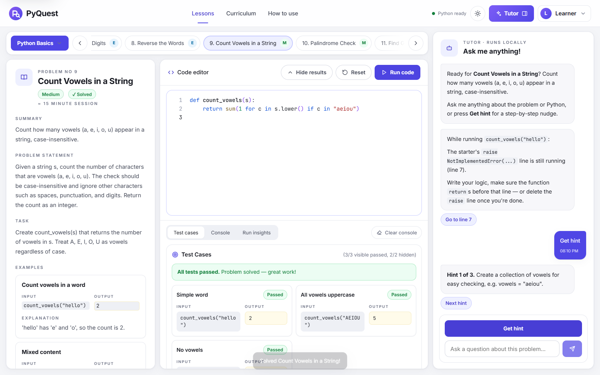
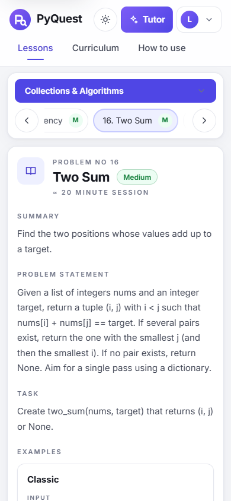

# PyQuest

**Learn Python by solving real problems — in your browser.** PyQuest is a no-account practice workspace: read a brief, write a function, run real Python 3 against visible and hidden tests, and get help from a built-in tutor that nudges instead of solving for you.

**Live site:** https://ali-kin4.github.io/py-quest-interactive-tutor/



## Features

- **Three-panel workspace.** The problem brief (summary, statement, task, worked examples, formats, constraints) sits beside a code editor with test results and a tutor panel.
- **30 problems in 3 tracks:** *Python Basics* (strings, branching, loops, Euclid's GCD), *Collections & Algorithms* (dicts, sets, two-sum, stacks, recursion, merging) and *Practical Python* (validation, log parsing, moving averages, a revenue capstone).
- **Real Python, no install.** Pyodide (CPython 3.12 on WebAssembly) runs in a Web Worker. It starts loading while you read. A **Stop** button and a 15-second timeout recover from infinite loops.
- **Transparent grading.** Visible tests show input, expected output and your output. Hidden tests probe edge cases. Tests also show printed output, error lines and per-run insights.
- **Tutor.** **Get hint** climbs a ladder: three hints, then a scaffold you can insert, then (if you insist) the reference solution. Ask “why is my code failing?” after a run to get a diagnosis of the error type, `None` returns, type mismatches, rounding or hidden edge cases. Ask about concepts (“what is a dictionary?”) for short explanations with examples.
- **Editor comforts:** syntax highlighting, line numbers, auto-indent, Tab/Shift-Tab block indent, Ctrl/⌘+Enter to run, drafts saved as you type.
- **Progress that stays yours.** Solved problems, attempts, hints and drafts live in `localStorage`. You can export and import them as JSON from the profile menu.
- **Light and dark themes, responsive down to phones, keyboard accessible.**



## Honest limits

- The tutor is **rule-based and local**, not a large language model. Nothing you type is sent anywhere.
- Grading runs in your browser. It gives you feedback and is **not** a secure exam, certification, or sandbox for untrusted code.
- The first run downloads Pyodide (~10 MB) from jsDelivr. Progress is lost if you clear site data, so export a backup.

## Run locally

```bash
npm start                 # serves http://127.0.0.1:8000 — Node 20+, nothing to install
```

Any static server works (`python -m http.server` too). There is no build step.

## Quality checks

```bash
npm test                  # unit tests: curriculum schema, tutor, store, router, escaping, highlighter
npm run verify:solutions  # grades all 30 reference solutions with the real harness under CPython
npm run test:e2e          # end-to-end in Chromium (needs: npm i --no-save playwright && npx playwright install chromium)
```

CI ([`.github/workflows/ci.yml`](.github/workflows/ci.yml)) runs all three on every pull request and uploads screenshots.

## Project structure

```text
index.html                 App shell (header, workspace, tutor, dialogs)
assets/                    Logo / favicon
src/
  main.js                  Entry point: wiring, theme, profile menu, routing
  app/                     store.js (local-first state), router.js (hash routes)
  data/                    curriculum.js + tracks/{basics,collections,practical}.js
  runtime/                 python-runner.js (worker client), python-worker.js, harness.py
  tutor/                   engine.js (hints, diagnosis, Q&A), glossary.js
  ui/                      dom.js, editor.js, highlight.js, tutor-panel.js, views/
  styles/                  tokens, base, layout, components, editor, pages
scripts/                   serve.mjs, verify-solutions.mjs, verify_solutions.py
tests/unit/                node:test suites
tests/e2e/                 Playwright smoke test
docs/                      ARCHITECTURE.md, LESSON_AUTHORING.md, images/
legacy/week1.html          The original Week 1 game, still reachable from the profile menu
```

See [docs/ARCHITECTURE.md](docs/ARCHITECTURE.md) for how grading and the tutor work, and [docs/LESSON_AUTHORING.md](docs/LESSON_AUTHORING.md) to add problems.

## Deploy

GitHub Pages serves the repository root of `main` with no build. After merging, check that Settings → Pages points at `main` / root.

## License & creator

MIT License. Created and maintained by **[Ali Jabbary](https://alijabbary.com)** — [GitHub](https://github.com/ali-kin4).
